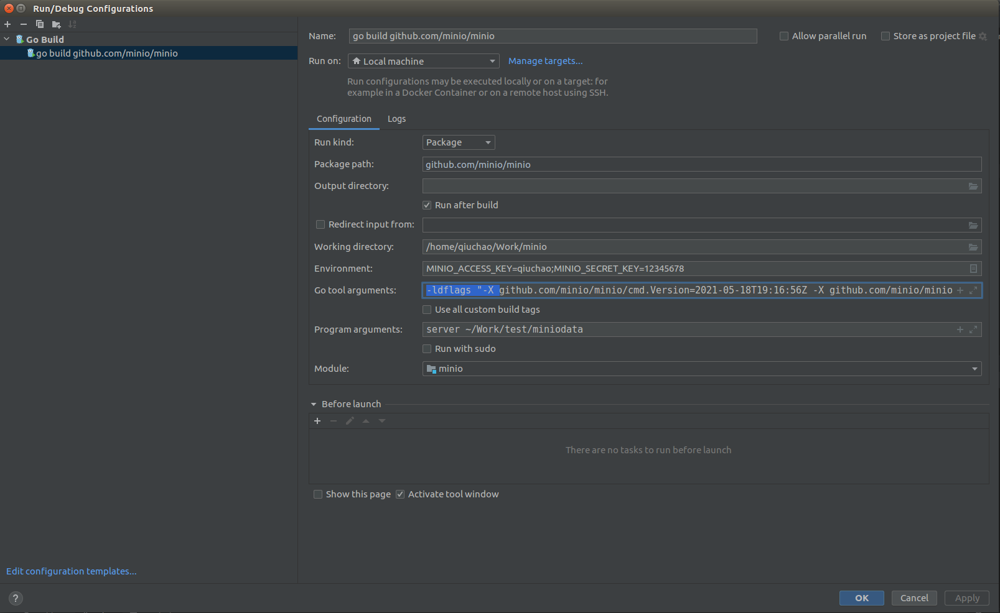
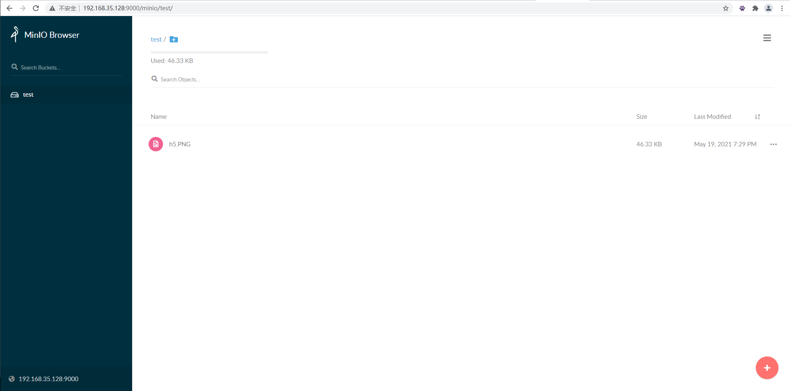

# 源码下载

- Server源码

  ```shell
  git clone https://github.com/minio/minio.git
  ```

  报`server certificate verification failed.` 可以执行:
  ```shell
  export GIT_SSL_NO_VERIFY=1
  ```
  
- Client源码

  ```shell
  git clone https://github.com/minio/mc.git
  ```

## 调试环境

- go语言需要1.16版本

- goland配置

  

  - Go tool arguments 要添加ldflags参数，可以用下面给出的参数，也可以自己`go run buildscripts/gen-ldflags.go`生成

    `-ldflags "-X github.com/minio/minio/cmd.Version=2021-05-18T19:16:56Z -X github.com/minio/minio/cmd.ReleaseTag=DEVELOPMENT.2021-05-18T19-16-56Z -X github.com/minio/minio/cmd.CommitID=4f5d75f22b4dbb98dd052fe4c80f01e391436b1d -X github.com/minio/minio/cmd.ShortCommitID=4f5d75f22b4d -X github.com/minio/minio/cmd.GOPATH=/usr/local/go16/bin/ -X github.com/minio/minio/cmd.GOROOT=/usr/local/go16/"`

  - 编译报permission denied就把对应目录权限改成777

- 浏览器访问

  

  - 浏览器http://127.0.0.1:9000访问登录页面
  - 账号就是配置到Environment的`MINIO_ACCESS_KEY`，密码是`MINIO_SECRET_KEY`
  - 接下来就可以创建桶，上传对象，调试代码了

# 引用资料

1. [Minio第一课：走进 Minio](https://zhuanlan.zhihu.com/p/148053565)
2. [MinIO环境搭建指导书-CentOS ](https://bbs.huaweicloud.com/forum/thread-40411-1-1.html)
3. [Invalid UI version in the JSON-RPC response](http://slack.minio.org.cn/question/468)

